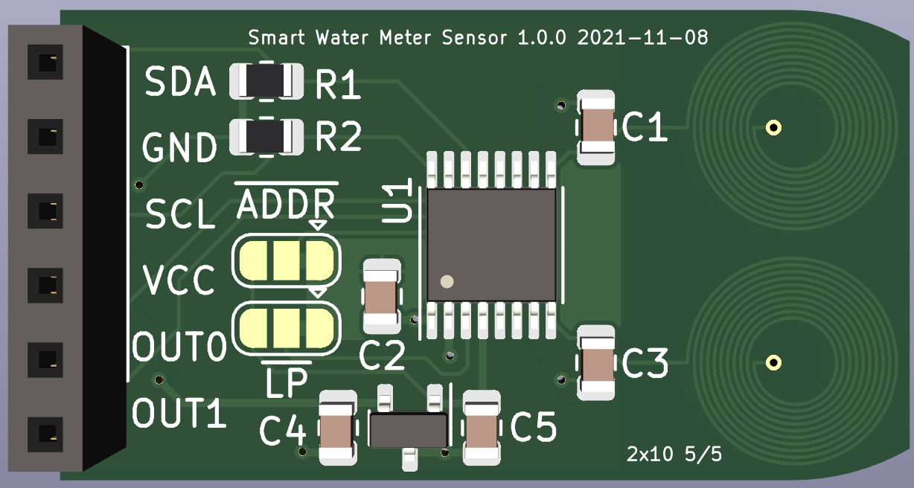
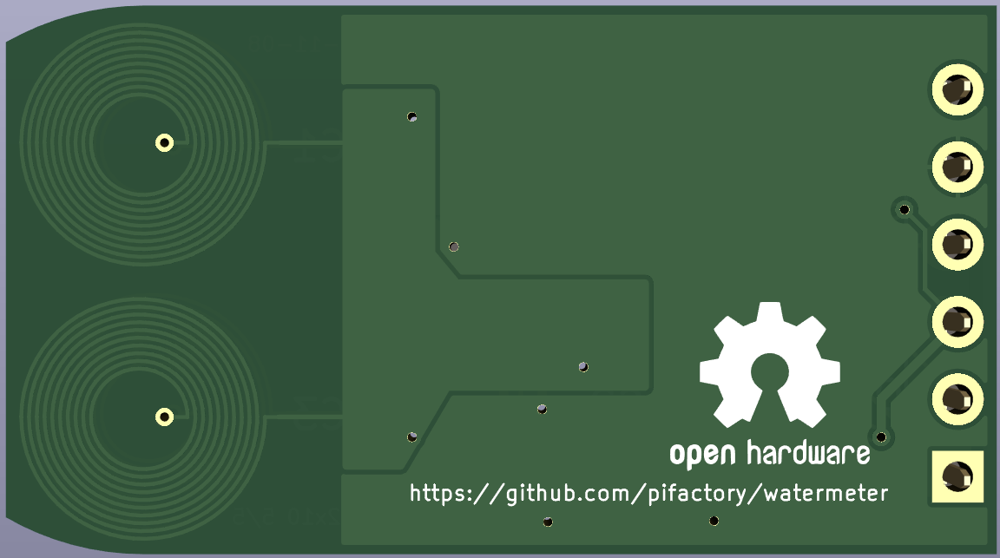
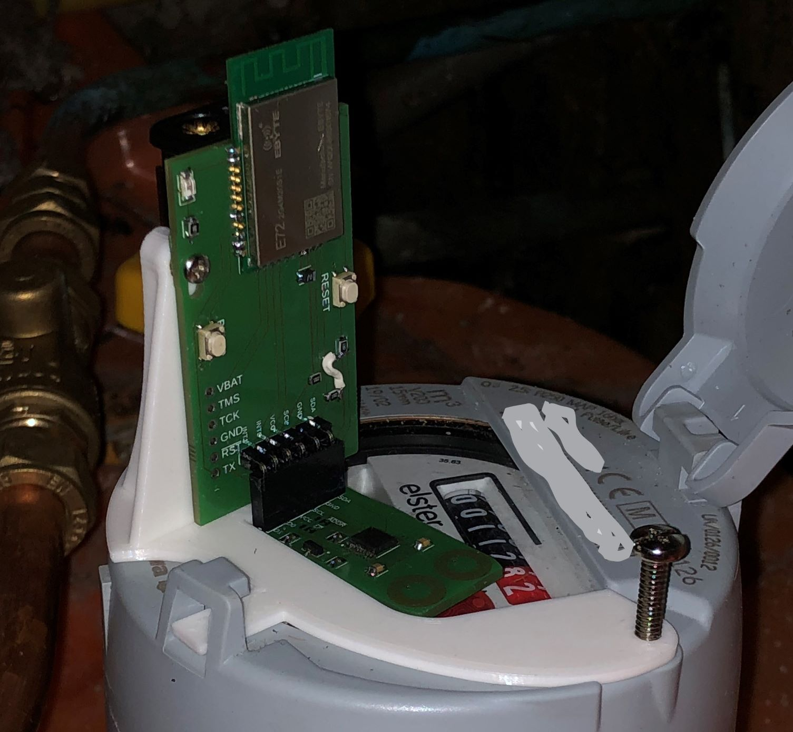
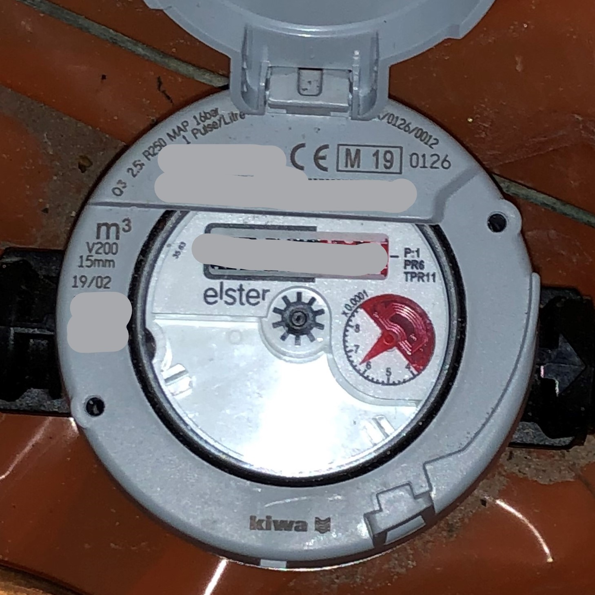

# Smart Water Meter Sensor
[![CC BY 4.0][cc-by-shield]][cc-by]

Design files for making inductive sensor for reading out smart water meters.

 

## Features

* 20 &mu;A in low-power mode (including microcontroller)
* Small footprint: 18mm x 32.5 mm, can be placed directly on the water meter glass
* Easy to use: inductive sensors are printed directly on the PCB
* Designed for wheel diameter of 18mm
* Includes 2 inductive sensors for reliable counting of the wheel turns

## How Smart Water Meter works

Many water meters are made 'smart-ready', ie they include a wheel under the glass
which makes 1 turn per liter. Half of the wheel contains some metal (copper) on it
which can be sensed by an inductive sensor.

Because of the costs water supply companies usually do not install smart reading device
on such meters, but some nerds among us are stubborn enough to design and install
their own reading device. Just to know how much water is used and be able to monitor it
with, say, a Home Assistant. It can be also used to detect leaks.

One inductive sensor is not enough for reliable readings. There are some corner
cases when the sensor will miss a turn of the wheel or count 1 turn 2 times. Think of it like
this: wheel can stop at any moment at any angle and then continue movement at any
time later on. During this stop environment can change significantly (temperature &
humidity) to fool the sensing circuit. On top of it, to save power, each inductive
sensor is scanned once in 800ms, ie there is no continous output from it. All in all,
2 inductive sensors allow to detect illogical readings and in many cases repair them.

For now here is just the sensor, controller is coming soon... I've made one for
Zigbee already and it runs on 2 AAA batteries.

Here is the photo of the first prototype:



## How to use design files

I used KiCAD 6 to make the design. You will probably also want to install [kicad-goodies](https://github.com/pifactory/kicad-goodies) libraries, but this is not required.

A word about choosing a PCB shop. Inductive sensors on the PCB require as much as possible turns
on as little space possible. This means that the traces have to be as thin as possible and the
spacing between them has to be as small as possible. Also there is no copper around them +
geometry of the traces = you might get shorts between traces if you push it to the limit.

Most shops out there (including JLCPCB) claim to be able to produce 6 mils traces with 6 mils spacing
between them. I work with AISLER and they produce 5/5 mils boards for the same price,
so this design has 5/5 PCB coils. I've made 6/6 PCB coils available in 
[kicad-goodies](https://github.com/pifactory/kicad-goodies), you can try them if 5/5
coils will not work for you. AISLER will need just *.kicad_pcb file, no Gerber is needed there and therefore not provided in this repo.

## Zigbee Microcontroller

This repo has all you need to make a Zigbee microcontroller for the sensor:

* KiCAD 6 design files for the PCB (incl schematic)
* Compiled firmware
* Configuration file for Zigbee2MQTT

Microcontroller is based on EBYTE module with CC2652P.  

Firmware has following features:

* Low power, should work for years on 2 AAA batteries
* Water usage data is buffered for 5 minutes
* When parent connection is lost: try to rejoin every 5 minutes
* Transmit power is set to 14dBm, this should be enough to get signal in challenging RF situations and yet to not use too much battery

Because of a bug in TI software, rejoin period cannot be longer than 5 minutes. Also rejoin uses more power than standard data report, so try to avoid situations when device stays on for longer periods without a connection to the network (like days, weeks, months)

Operation with 2 buttons and 1 LED:
* Join new network: click BTN1
* Leave network: press BTN1 for at least 10 seconds and release the button (long click)
* Immediately send data (when part of the network): click BTN1
* Rejoin (when parent is lost): click BTN1
* RESET button restarts the device
* LED blink once device (re-)joins Zigbee network

### Zigbee2MQTT

Place provided `pifactory_watermeter.js` file in the same directory as `configuration.yaml` file.

Add these lines to `configuration.yaml` file:

```yaml
external_converters:
    pifactory_watermeter.js
```

Restart Zigbee2MQTT and join the device

## Holder

I've made a holder which fits my Elster water meter. Meter without sensor looks like this:



I didn't tried the holder on any other meter, but I suspect it fits different models as well. Please share your meters/holders or contact me if you need help fitting this sensor to your meter.

---
This work is licensed under a
[Creative Commons Attribution 4.0 International License][cc-by].

[![CC BY 4.0][cc-by-image]][cc-by]

[cc-by]: http://creativecommons.org/licenses/by/4.0/
[cc-by-image]: https://i.creativecommons.org/l/by/4.0/88x31.png
[cc-by-shield]: https://img.shields.io/badge/License-CC%20BY%204.0-lightgrey.svg